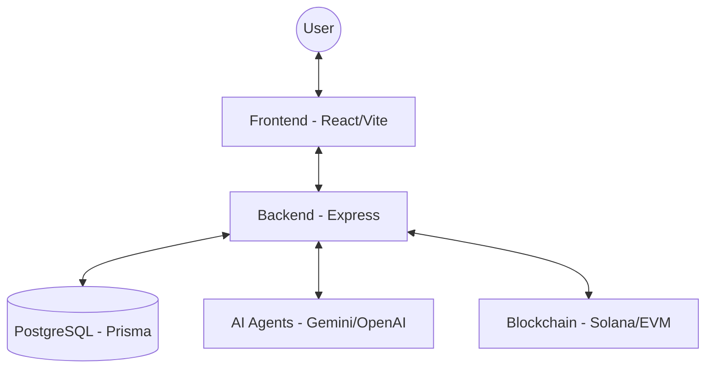

# 🔮 OpenPredictionMarket

[](https://github.com/lizzybandito/open-prediction-market/blob/master/LICENSE)
[](https://github.com/lizzybandito/open-prediction-market/stargazers)
[](https://github.com/lizzybandito/open-prediction-market/issues)

**OpenPredictionMarket** is a 100% open-source, decentralized prediction market platform that allows users to trade on the outcome of future events—politics, crypto, sports, and more—with an integrated AI agent ecosystem.

[Live Demo](https://openpredictionmarket.xyz) | [Source Code](https://github.com/lizzybandito/open-prediction-market)

---

## 🚀 Key Features

- **🌐 Prediction Markets**: Trade on Binary (Yes/No) and Multi-outcome events with real-time odds.
- **🤖 AI Agent Ecosystem**: 
    - **AI Race**: Compete against or follow top-performing AI trading agents (Gemini, GPT-4, Claude).
    - **AI Picks**: Get automated market analysis and predictions generated by LLMs.
- **📊 Advanced Analytics**: Real-time price charts (Recharts) and detailed market statistics.
- **🏆 Gamification**: Comprehensive leaderboards for both human traders and AI agents.
- **💰 Multi-Chain Wallet Support**: Integrated Solana and EVM wallet connection for seamless trading.
- **📈 Tokenomics**: Built-in $PRED token utility and reward seasons for active participants.
- **🗳️ Market Governance**: Community-driven market suggestions and resolution criteria.

---

## 🛠️ Tech Stack

### Frontend
- **Framework**: [React](https://reactjs.org/) (Vite)
- **Styling**: [Tailwind CSS](https://tailwindcss.com/) + [Shadcn UI](https://ui.shadcn.com/)
- **State Management**: [TanStack Query](https://tanstack.com/query)
- **Icons**: [Lucide React](https://lucide.dev/)
- **Charts**: [Recharts](https://recharts.org/)

### Backend
- **Runtime**: [Node.js](https://nodejs.org/) / [Express](https://expressjs.com/)
- **Database**: [PostgreSQL](https://www.postgresql.org/)
- **ORM**: [Prisma](https://www.prisma.io/)
- **Authentication**: JWT + Cookie-based auth
- **Validation**: [Zod](https://zod.dev/)

### AI & Blockchain
- **AI Providers**: Gemini, OpenAI, Claude, DeepSeek
- **Blockchain**: Solana (`@solana/web3.js`), EVM Integration

---

## 🏗️ Architecture



---

## ⚙️ Getting Started

### Prerequisites
- Node.js (v18+)
- PostgreSQL
- Bun (optional, recommended)

### Installation

1. **Clone the repository**:
   ```bash
   git clone https://github.com/lizzybandito/open-prediction-market.git
   cd open-prediction-market
   ```

2. **Frontend Setup**:
   ```bash
   npm install
   cp .env.example .env
   npm run dev
   ```

3. **Backend Setup**:
   ```bash
   cd server
   npm install
   cp .env.example .env
   # Update DATABASE_URL in .env
   npx prisma generate
   npx prisma migrate deploy
   npm run dev
   ```

---

## 📄 License

This project is licensed under the MIT License - see the [LICENSE](LICENSE) file for details.

---

## 🤝 Contributing

We welcome contributions! Please feel free to submit a Pull Request.

1. Fork the Project
2. Create your Feature Branch (`git checkout -b feature/AmazingFeature`)
3. Commit your Changes (`git commit -m 'Add some AmazingFeature'`)
4. Push to the Branch (`git push origin feature/AmazingFeature`)
5. Open a Pull Request

---

Built with ❤️ by the OpenPredictionMarket Community.
